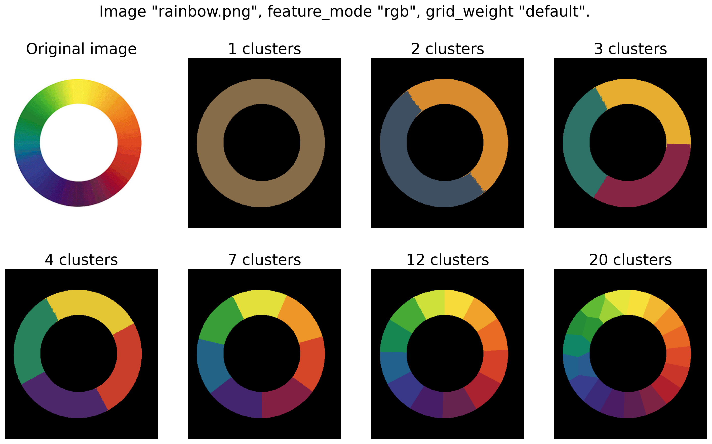
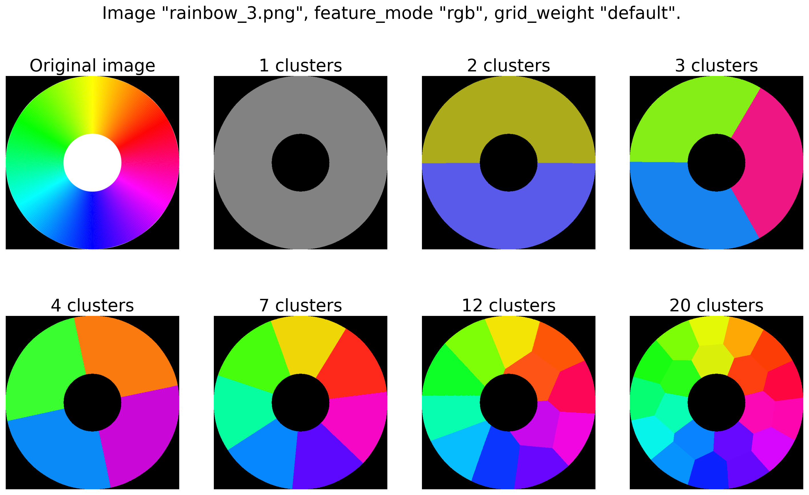
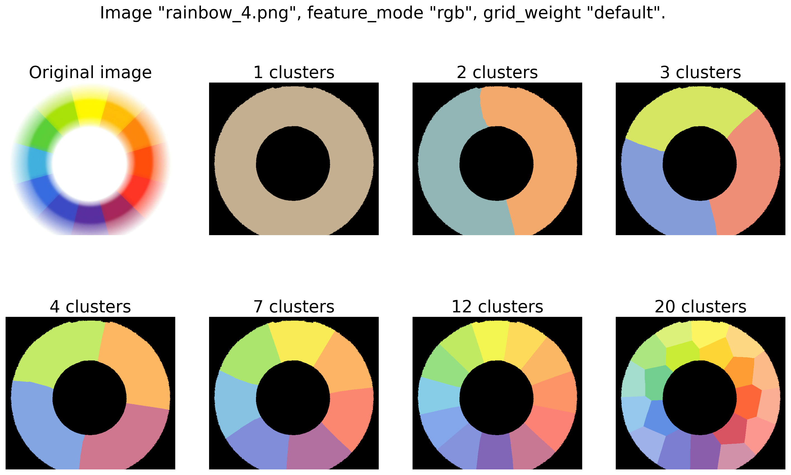
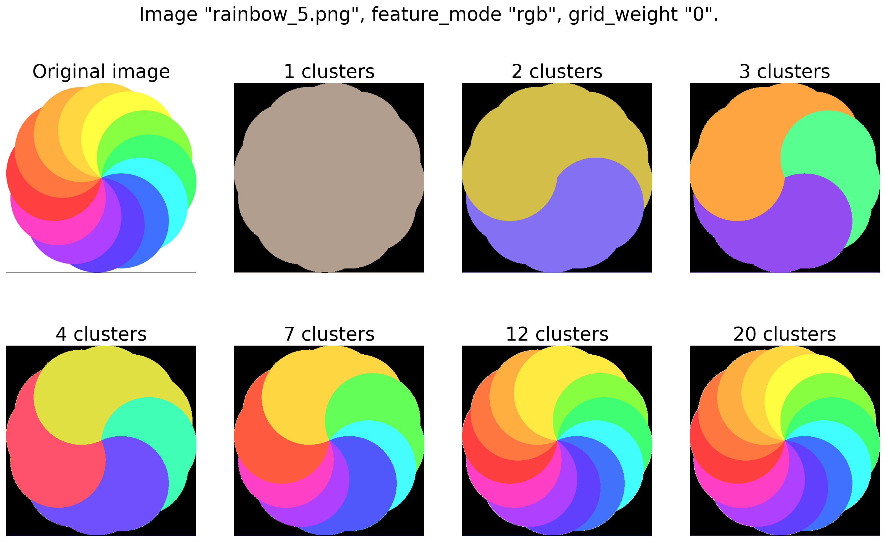
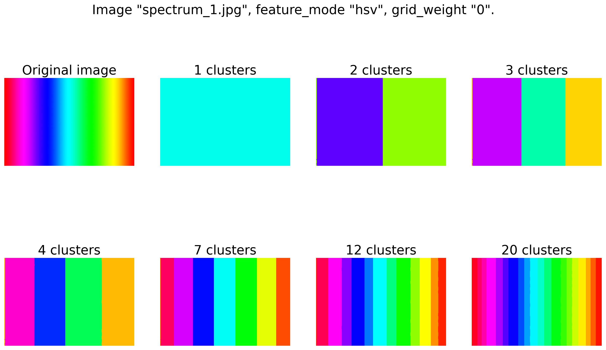

# Clustering pixels in rainbow images by color

Simple clustering of pixels in different rainbow/spectrum images by it's color.
All you need to do this is:
* Make **threshold binarization** to preprocess white and/or black background as 
single cluster.
* Obtain feature vectors from images using **RGB** or **HSV** color scheme.
* Add **pixels coordinates as weighted features** to provide clusters to have the
similar size and low noise.
* Profit! :)

### 1. Preparing to work

Clone this project:
```shell
git clone https://github.com/Chifffa/rainbow_clustering.git
cd rainbow_clustering
```

I used **Python 3.9** and some dependencies listed in [requirements.txt](requirements.txt).
```shell
pip install -r requirements.txt
```

### 2. Usage

There is the **`RainbowClustering`** class in [rainbow_clustering.py](rainbow_clustering.py).
Here is a simple usage example:

```python
import cv2

from rainbow_clustering import RainbowClustering

image = cv2.imread('images/rainbow.png')
image = cv2.cvtColor(image, cv2.COLOR_BGR2RGB)

clustering_obj = RainbowClustering(clusters=7, feature_mode='rgb')
result, centroids = clustering_obj.predict(image, grid_weight='default')
```

You should set **`clusters`** and you can set some other parameters
of the **`RainbowClustering`** object:
* **`clusters`** - number of clusters (background is not included here). If there is a
white/black background in the image, it will be processed as additional single cluster (see examples).
Otherwise, there will be exactly specified number of clusters.
* **`feature_mode`** - `rgb` or `hsv` features to use. In most cases `rgb` seem
to be better, but sometimes `hsv` looks better.
* **`verbose`** - set to `True` to enable verbosity mode.
* **`white_threshold`** - threshold value for white color `[0, 255]`. 
There will be no white binarization if you set the value out of borders.
* **`black_threshold`** - threshold value for black color `[0, 255]`, similar case.
* **`clustering_method`** - only `kmeans` is available now.

To process the image you should pass the **RGB image numpy array** to the **`predict`** method.
You can also pass the **`grid_weight`** parameter: weight value for pixels coordinates features.
By default, it uses the **`clusters`** value as weight. You can pass `0` if you don't need
to use pixels coordinates features, or you can pass any float value.

**`predict`** method returns:
* **`mask`** -  numpy array with shape (height, width, clusters). Each value of it is an integer number
in the range `[0, clusters]`.
* **`centroids`** - numpy array with shape (clusters, 3). There are `clusters` vectors.
Each vector as an **RGB color vector**. It is a color value of the cluster's center. 

### 3. Some examples

You can see all original images in [images folder](images) and examples of processing
using [rgb features](results_rgb) and [hsv features](results_hsv).

There are exactly `clusters + 1` colors in each mask
(except images without background, e.g. [spectrum_1.jpg](images/spectrum_1.jpg)).
Black color is for white and/or black background. Each other color is
from the corresponding cluster center vector.

You can use the [main.py](main.py) script to obtain these results.

Here are some of the best and the most interesting examples of work. You can see
the image name and used parameters at the top of the image.

First there are the results of clustering of the original rainbow image:
I think it looks pretty good.


The second image is similar, but I really like how it looks.


In the next example you can see how accurate it was processed to find 12 clusters.


Further you can see that in some cases it is better not to use pixels coordinates features.


And finally in some cases it is better to use `hsv` features.
